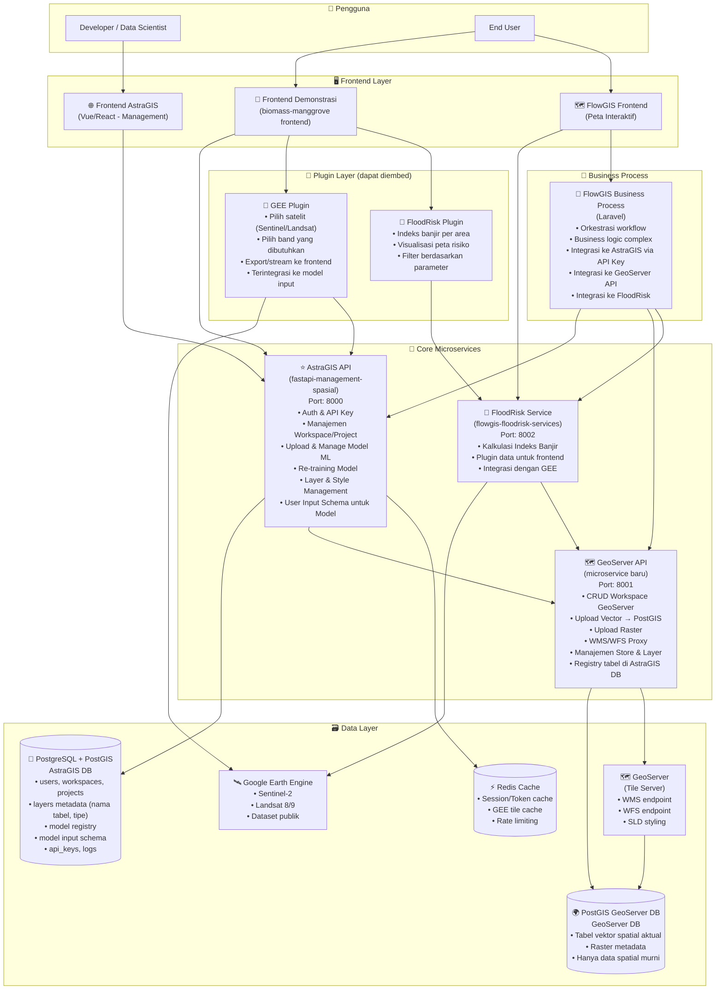

# 🏗️ Rancangan Arsitektur Ekosistem Microservices

> **Tanggal:** 2026-09-28 | **Status:** Draft Awal

---

## 📌 Gambaran Besar

Ekosistem ini dirancang agar setiap microservice dapat **digunakan ulang (reusable)** tanpa memulai dari nol. AstraGIS menjadi tulang punggung yang menyediakan auth, manajemen data, dan model ML; sedangkan GeoServer, GEE, dan FloodRisk hadir sebagai microservice/plugin yang dapat dipasang ke berbagai frontend.

---

## 🗺️ Diagram Arsitektur Sistem



---

## 📦 Detail Setiap Komponen

### ⭐ 1. AstraGIS API (Core — sudah ada, perlu extension)
**Repo:** `fastapi-management-spasial`

**Yang sudah ada:**
- Auth (JWT + OTP Email)
- API Key management
- Workspace & Project management
- Layer & Layer Group management
- GeoServer proxy (workspace, store, layer)
- Raster upload & management
- Vector upload & management

**Yang perlu ditambahkan:**
```
app/
├── routes/
│   ├── model.py              ← BARU: upload, list, delete model
│   ├── model_training.py     ← BARU: trigger re-training
│   └── model_input_schema.py ← BARU: definisi input fields model
├── services/
│   ├── model_service.py      ← BARU: logic upload & versioning model
│   ├── training_service.py   ← BARU: async training dengan BackgroundTask
│   └── geoserver_proxy.py    ← PISAH: dipindah ke GeoServer microservice
├── models/
│   ├── ml_model.py           ← BARU: table model registry
│   ├── model_input.py        ← BARU: table schema input model
│   └── training_job.py       ← BARU: table training history
└── migrations/
    └── add_ml_tables.py      ← BARU: migrasi tabel baru
```

**Database Tables baru di AstraGIS:**
```sql
-- Registry model ML
CREATE TABLE ml_models (
    id UUID PRIMARY KEY DEFAULT gen_random_uuid(),
    name VARCHAR(255) NOT NULL,
    description TEXT,
    version VARCHAR(50),
    file_path TEXT,           -- path file .joblib/.pkl/.h5
    model_type VARCHAR(50),   -- 'sklearn', 'keras', 'pytorch'
    owner_id UUID REFERENCES users(id),
    workspace_id UUID REFERENCES workspaces(id),
    is_public BOOLEAN DEFAULT FALSE,
    created_at TIMESTAMPTZ DEFAULT NOW()
);

-- Schema input untuk model (user-defined)
CREATE TABLE model_input_schemas (
    id UUID PRIMARY KEY DEFAULT gen_random_uuid(),
    model_id UUID REFERENCES ml_models(id),
    field_name VARCHAR(100) NOT NULL,  -- e.g. "B4", "NDVI", "elevation"
    field_label VARCHAR(255),          -- label yang ditampilkan di UI
    data_type VARCHAR(50),             -- 'float', 'int', 'band', 'index'
    source_type VARCHAR(50),           -- 'gee_band', 'gee_index', 'manual', 'vector_field'
    is_required BOOLEAN DEFAULT TRUE,
    default_value TEXT,
    description TEXT,
    display_order INT DEFAULT 0
);

-- History training
CREATE TABLE training_jobs (
    id UUID PRIMARY KEY DEFAULT gen_random_uuid(),
    model_id UUID REFERENCES ml_models(id),
    status VARCHAR(50),  -- 'pending', 'running', 'completed', 'failed'
    metrics JSONB,       -- {'rmse': 0.12, 'r2': 0.89, ...}
    started_at TIMESTAMPTZ,
    completed_at TIMESTAMPTZ,
    log_output TEXT
);

-- Metadata layer di GeoServer DB (bukan data aktual, hanya referensi)
CREATE TABLE spatial_layer_registry (
    id UUID PRIMARY KEY DEFAULT gen_random_uuid(),
    layer_id UUID REFERENCES layers(id),
    postgis_table_name VARCHAR(255),    -- nama tabel di GeoServer DB
    geometry_type VARCHAR(50),          -- 'Point', 'LineString', 'Polygon', 'MultiPolygon'
    srid INT DEFAULT 4326,
    attribute_schema JSONB,             -- {'field_name': 'type', ...}
    feature_count INT,
    bounding_box JSONB
);
```

---

### 🗺️ 2. GeoServer Microservice (BARU — pisah dari AstraGIS)
**Repo baru:** `geoserver-microservice` (FastAPI)

**Fungsi:**
- Menjadi satu-satunya penghubung ke GeoServer REST API
- Upload vector → PostGIS (DB terpisah) → publish ke GeoServer
- Upload raster → publish ke GeoServer
- Memberitahu AstraGIS registry nama tabel & tipe data

**Struktur:**
```
geoserver-microservice/
├── app/
│   ├── main.py
│   ├── config/
│   │   ├── database.py      ← koneksi ke PostGIS GeoServer DB
│   │   └── geoserver.py     ← koneksi ke GeoServer REST API
│   ├── routes/
│   │   ├── vector.py        ← upload shapefile/GeoJSON → PostGIS
│   │   ├── raster.py        ← upload GeoTIFF
│   │   ├── workspace.py     ← CRUD workspace GeoServer
│   │   ├── store.py         ← CRUD datastore
│   │   ├── layer.py         ← CRUD layer + publish
│   │   ├── style.py         ← upload SLD
│   │   └── wms_proxy.py     ← proxy WMS/WFS request
│   ├── services/
│   │   ├── vector_service.py     ← geopandas → PostGIS
│   │   ├── raster_service.py     ← upload raster
│   │   ├── geoserver_service.py  ← wrapper GeoServer REST API
│   │   └── registry_service.py  ← kirim metadata ke AstraGIS
│   └── models/
│       └── spatial_tables.py     ← track tabel dinamis di PostGIS
├── docker-compose.yml
├── Dockerfile
└── requirements.txt
```

**Flow upload vector:**
```
User Upload Shapefile/GeoJSON
    ↓
GeoServer API (FastAPI)
    ↓ (geopandas)
PostGIS GeoServer DB → tabel baru: e.g. "vector_layer_abc123"
    ↓ (GeoServer REST API)
GeoServer → publish layer dari PostGIS
    ↓ (callback ke AstraGIS)
AstraGIS DB → spatial_layer_registry: {table_name: "vector_layer_abc123", geom_type: "Polygon"}
```

---

### 🌊 3. FloodRisk Service (sudah ada, perlu plugin interface)
**Repo:** `flowgis-floodrisk-services`

**Tambahan yang dibutuhkan:**
- Endpoint `/plugin/info` → metadata plugin untuk frontend
- Endpoint `/plugin/compute` → komputasi indeks berdasarkan parameter user
- Standarisasi response format agar bisa diembed sebagai plugin

---

### 🔌 4. Plugin System (Frontend Embeddable)

Plugin adalah **komponen Vue/React** yang bisa diembed di berbagai frontend:

```typescript
// Penggunaan plugin di frontend manapun
import { GEEPlugin, FloodRiskPlugin } from '@astragis/plugins'

// GEE Plugin
<GEEPlugin
  apiKey="your-astragis-key"
  onBandSelect={(bands) => setModelInputs(bands)}
  satellites={['SENTINEL2', 'LANDSAT8']}
/>

// FloodRisk Plugin  
<FloodRiskPlugin
  apiKey="your-astragis-key"
  geometry={areaGeometry}
  indices={['FRI', 'DEM_RISK', 'POPULATION_DENSITY']}
/>
```

**GEE Plugin features:**
- Pilih satelit: Sentinel-2, Landsat 8/9, MODIS
- Pilih band: pilih dari daftar band yang tersedia
- Pilih composite method: median, mean, mosaic
- Set tanggal & cloud cover filter
- Preview thumbnail di peta
- Export ke model input

**FloodRisk Plugin features:**
- Input area (draw polygon / upload GeoJSON)
- Pilih indeks: FRI, kedalaman banjir, kerentanan populasi
- Visualisasi choropleth di peta
- Export data sebagai tabel/GeoJSON

---

### 🧪 5. Model Demonstration (Frontend Demonstrasi — extend biomass frontend)

**Tambahan fitur di frontend demonstrasi:**

```
Halaman Demonstrasi Model:
┌─────────────────────────────────────────────────┐
│  Pilih Model: [Biomass Mangrove v2.1    ▼]      │
├─────────────────────────────────────────────────┤
│  Input Configuration (dari model_input_schema): │
│  ┌─────────────────┐  ┌──────────────────────┐  │
│  │ 🛰️ GEE Plugin  │  │ 📊 Manual Input     │  │
│  │ Band B4: [---] │  │ Elevation: [___]    │  │
│  │ Band B8: [---] │  │ Slope:    [___]    │  │
│  │ NDVI:   [---] │  │                    │  │
│  └─────────────────┘  └──────────────────────┘  │
│                                                  │
│  [🔄 Ambil dari GEE]  [📁 Upload CSV]           │
├─────────────────────────────────────────────────┤
│  Area of Interest:                               │
│  [🗺️ Draw on Map] [📤 Upload GeoJSON]           │
├─────────────────────────────────────────────────┤
│  [▶️ Jalankan Prediksi]                          │
├─────────────────────────────────────────────────┤
│  Hasil:                                          │
│  📊 Chart | 🗺️ Map | 📥 Download Report         │
└─────────────────────────────────────────────────┘
```

---

### 🔗 6. FlowGIS Integration

**FlowGIS Frontend** menggunakan plugin via npm package:
```javascript
// flowgis-frontend/.env
VITE_ASTRAGIS_URL=https://api.astragis.ikya.my.id
VITE_ASTRAGIS_API_KEY=fk_xxxxxxxxxxxx

// Plugin embed di peta FlowGIS
import { FloodRiskPlugin, GEEPlugin } from '@astragis/plugins'
```

**FlowGIS Business Process (Laravel)** berkomunikasi via API Key:
```php
// Contoh integrasi di Laravel
$astragis = new AstraGISClient(config('astragis.api_key'));
$layers = $astragis->getLayers($workspaceId);
$geoserver = new GeoServerClient(config('geoserver.api_key'));
$geoserver->publishVector($geojsonData);
```

---

## 🗺️ Roadmap Implementasi

### Phase 1: Pisahkan GeoServer (2-3 minggu)
- [ ] Buat repo `geoserver-microservice` baru
- [ ] Pindahkan semua logika GeoServer dari AstraGIS ke sana
- [ ] Buat tabel `spatial_layer_registry` di AstraGIS
- [ ] Update frontend untuk menggunakan endpoint baru
- [ ] Deploy & test

### Phase 2: ML Model Management di AstraGIS (2-3 minggu)
- [ ] Tambah tabel `ml_models`, `model_input_schemas`, `training_jobs`
- [ ] Buat routes: `/models`, `/models/{id}/train`, `/models/{id}/schema`
- [ ] Implementasi upload model (.joblib, .pkl, .h5, .pt)
- [ ] Implementasi background training dengan FastAPI BackgroundTasks
- [ ] Buat UI manajemen model di frontend AstraGIS

### Phase 3: Plugin GEE & FloodRisk (3-4 minggu)
- [ ] Standarisasi FloodRisk Service menjadi plugin-ready
- [ ] Buat GEE Plugin component (Vue/React)
- [ ] Buat FloodRisk Plugin component
- [ ] Publish sebagai npm package `@astragis/plugins`
- [ ] Dokumentasi penggunaan plugin

### Phase 4: Frontend Demonstrasi + Model Input Schema (2-3 minggu)
- [ ] Update frontend demonstrasi (biomass-manggrove frontend)
- [ ] Tambah halaman model selection
- [ ] Implementasi dynamic form berdasarkan `model_input_schema`
- [ ] Integrasikan GEE Plugin untuk auto-fill band input
- [ ] Tambah peta hasil prediksi

### Phase 5: FlowGIS Integration (2 minggu)
- [ ] Integrasi FloodRisk & GEE Plugin di FlowGIS Frontend
- [ ] Update FlowGIS Business Process untuk pakai AstraGIS API Key
- [ ] E2E testing seluruh sistem

---

## 🔐 Strategi Authentication

```
AstraGIS mengelola semua auth:
- JWT Token → untuk frontend langsung
- API Key (fk_xxx) → untuk service-to-service (FlowGIS BP, GeoServer MS)
- Scoped API Key → bisa dibatasi per endpoint/method

GeoServer Microservice:
- Verifikasi API Key ke AstraGIS sebelum eksekusi
- Cache hasil verifikasi di Redis (TTL: 60s)

FloodRisk Service:
- Sama, verifikasi API Key ke AstraGIS
```

---

## 📡 Inter-Service Communication

```
Semua komunikasi antar service via REST + API Key header:
X-AstraGIS-Key: fk_xxxxxxxxxxxxxxxx

Contoh flow: User upload vector di FlowGIS
1. FlowGIS Frontend → POST /api/vector (dengan Bearer JWT)
2. FlowGIS BP (Laravel) → POST geoserver-ms/vector (dengan X-AstraGIS-Key)
3. GeoServer MS → verifikasi key ke AstraGIS
4. GeoServer MS → simpan ke PostGIS GeoServer DB
5. GeoServer MS → publish ke GeoServer
6. GeoServer MS → callback ke AstraGIS: register layer metadata
7. AstraGIS → update spatial_layer_registry
8. Response balik ke FlowGIS Frontend
```

---

## 🐳 Docker Compose Ekosistem

```yaml
version: '3.8'
services:
  # Core
  astragis-api:
    image: astragis-api:latest
    ports: ["8000:8000"]
    
  # GeoServer MS
  geoserver-ms:
    image: geoserver-ms:latest
    ports: ["8001:8001"]
    
  # FloodRisk
  floodrisk-service:
    image: floodrisk:latest
    ports: ["8002:8002"]
    
  # Data
  astragis-db:
    image: postgis/postgis:15-3.3
    # DB untuk AstraGIS (metadata)
    
  geoserver-db:
    image: postgis/postgis:15-3.3
    # DB untuk GeoServer (data spatial aktual)
    
  geoserver:
    image: kartoza/geoserver:latest
    
  redis:
    image: redis:7-alpine
```

---

## ✅ Feasibility Assessment

| Komponen | Feasibility | Effort | Priority |
|---|---|---|---|
| Pisah GeoServer MS | ✅ Sangat Mungkin | Medium | 🔴 Tinggi |
| ML Model Management | ✅ Sangat Mungkin | Medium | 🔴 Tinggi |
| Model Input Schema | ✅ Sangat Mungkin | Low-Medium | 🔴 Tinggi |
| GEE Plugin | ✅ Mungkin | High | 🟡 Menengah |
| FloodRisk Plugin | ✅ Sangat Mungkin | Medium | 🟡 Menengah |
| Frontend Demonstrasi | ✅ Sangat Mungkin | Medium | 🟡 Menengah |
| npm Plugin Package | ✅ Mungkin | High | 🟢 Rendah |
| FlowGIS Integration | ✅ Sangat Mungkin | Low | 🟢 Rendah |

**Kesimpulan: SEMUA komponen sangat feasible untuk diimplementasikan!**
